# Iroh Mesh Architecture

This document provides detailed architectural diagrams and explanations for the Iroh Mesh service mesh implementation.

## System Overview

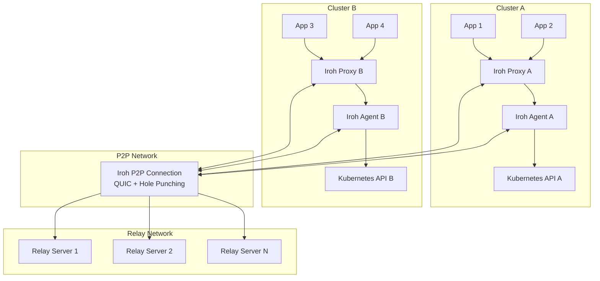

## Component Architecture

### Mesh Proxy Architecture

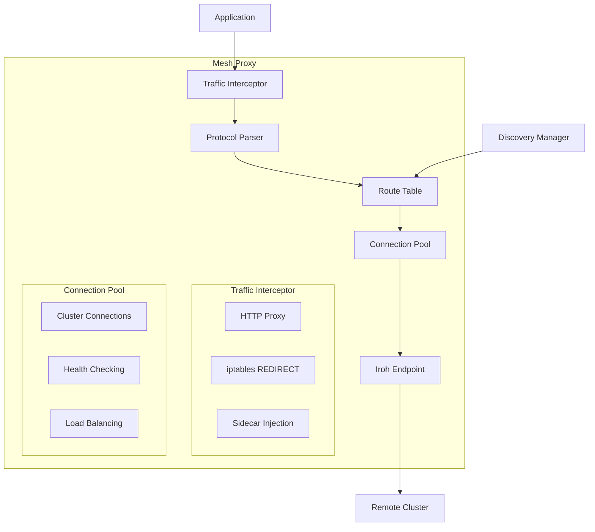

### Mesh Agent Architecture

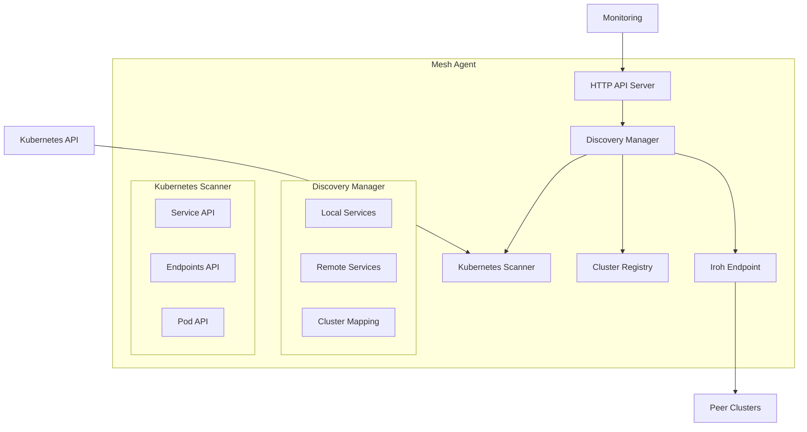

## Traffic Flow Diagrams

### Intra-Cluster Communication

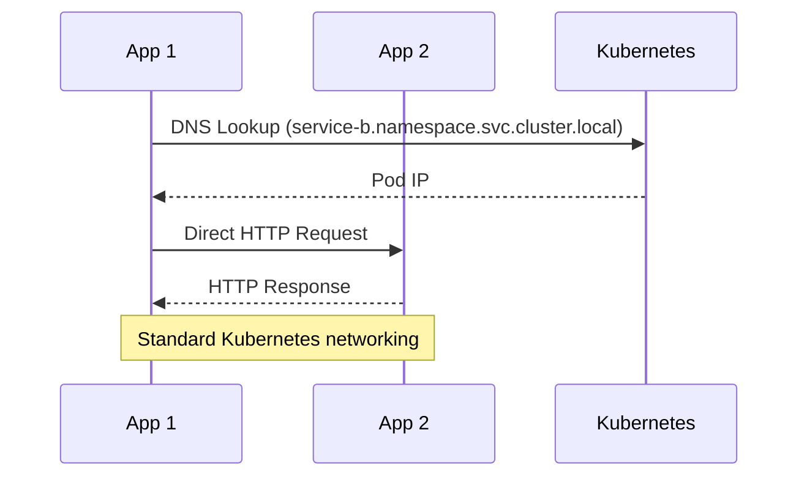

### Cross-Cluster Communication

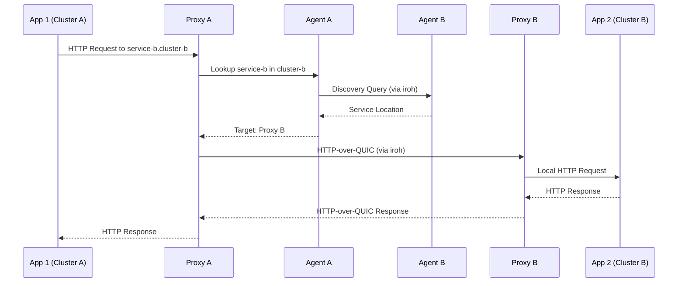

## Connection Establishment

### Initial Cluster Discovery

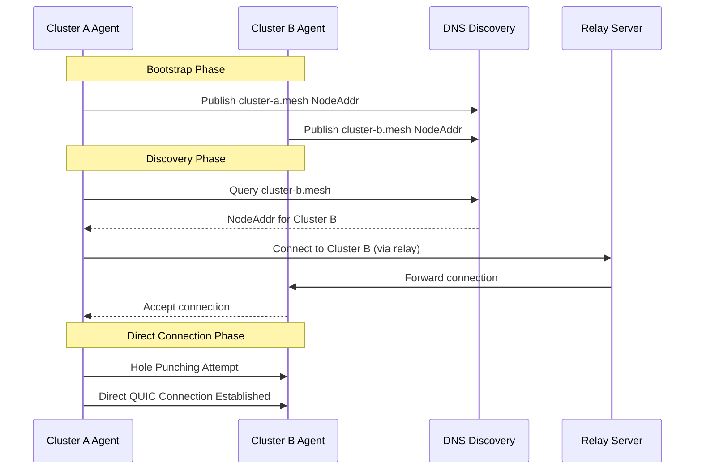

### Service Discovery Protocol

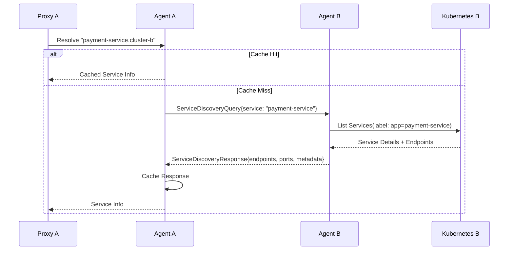

## Data Structures

### Core Types

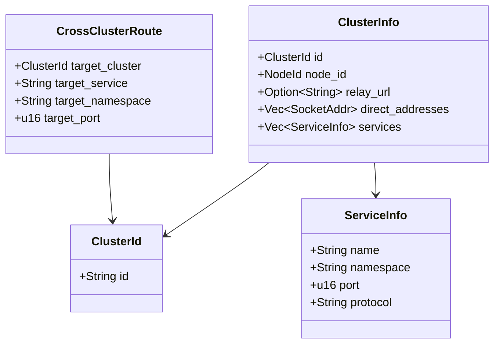

### Configuration Hierarchy

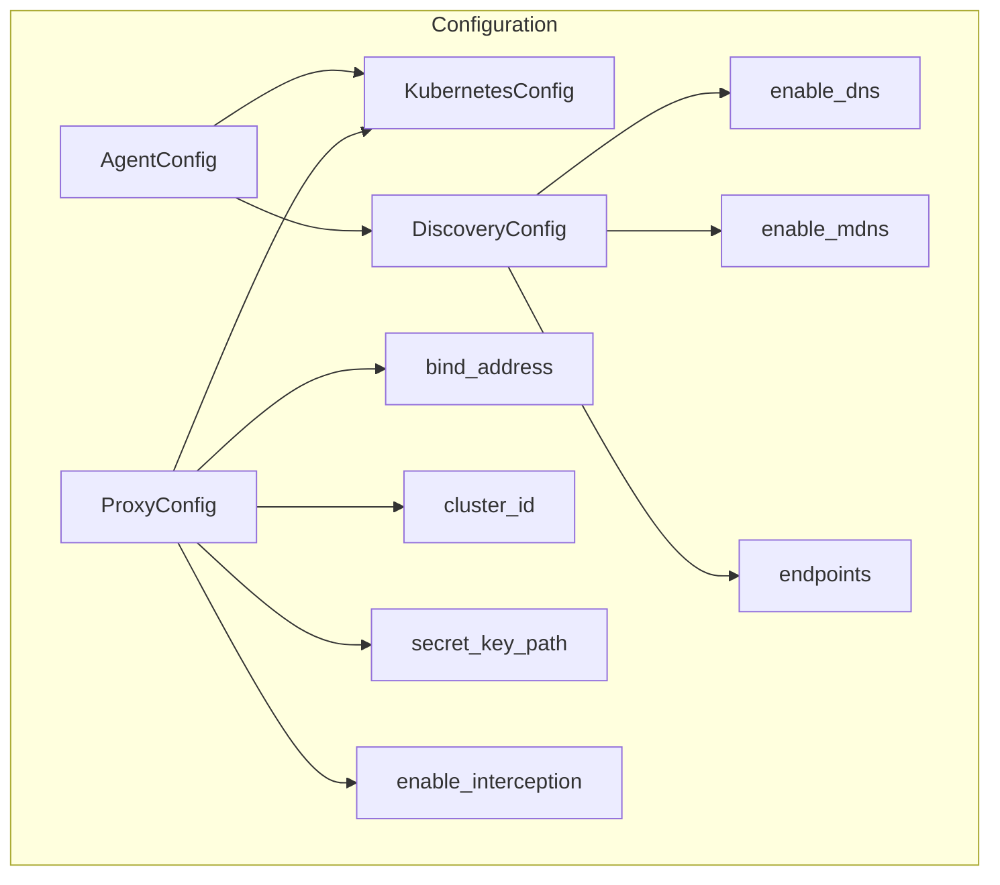

## Deployment Models

### Sidecar Deployment

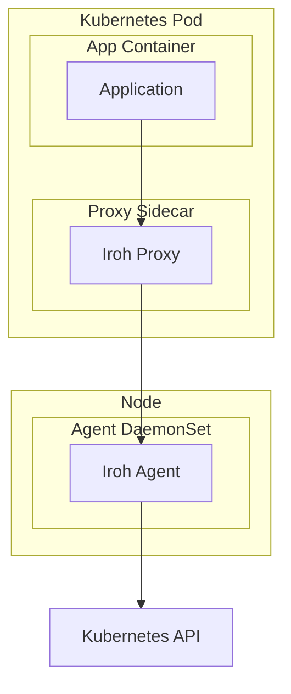

### Node-Level Deployment

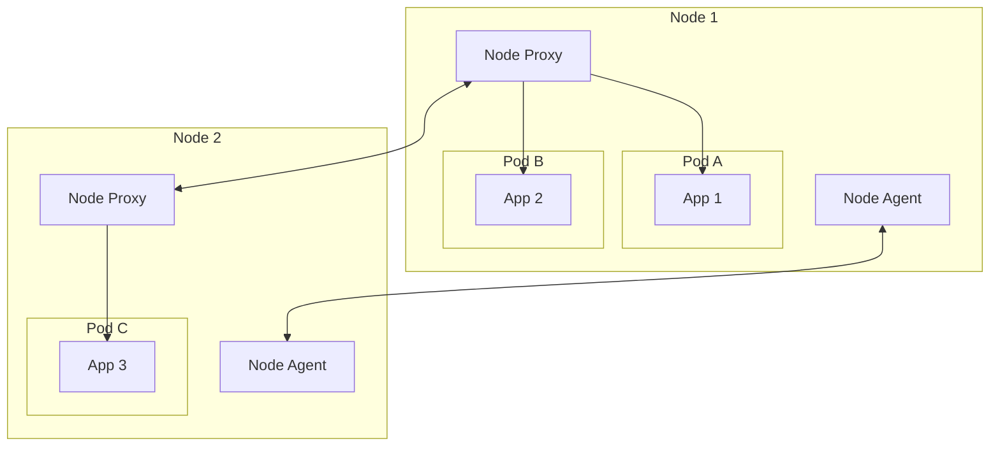

## Security Architecture

### Authentication & Authorization

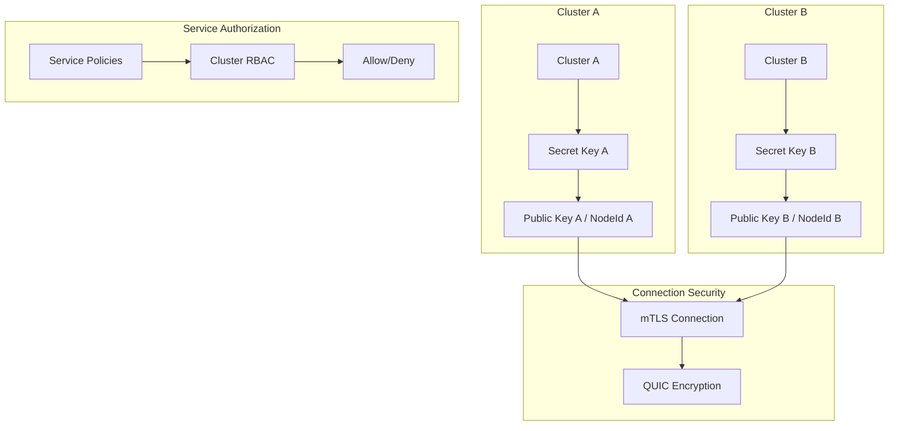

### Traffic Encryption

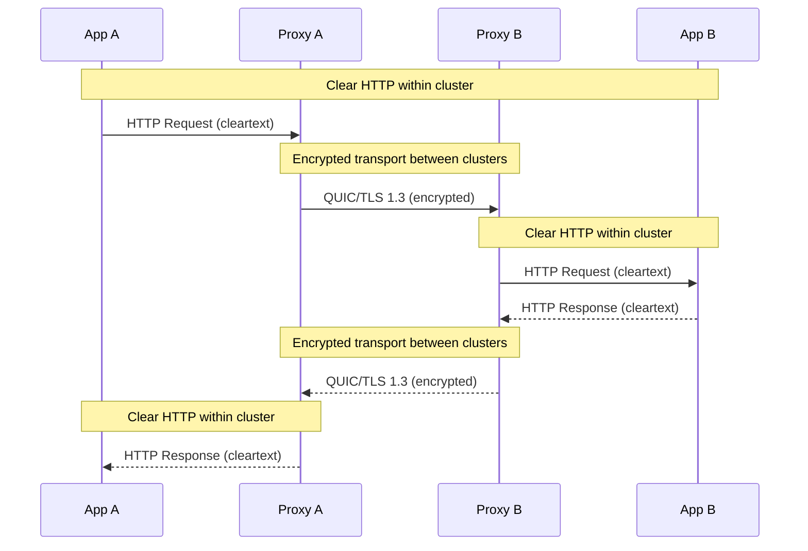

## Performance Characteristics

### Connection Lifecycle

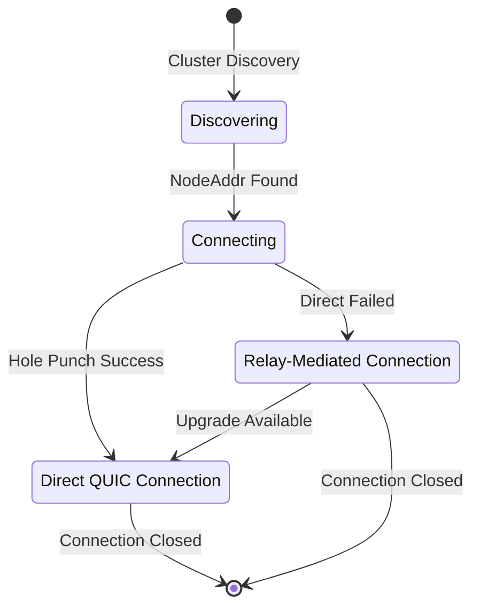

### Load Balancing Strategy

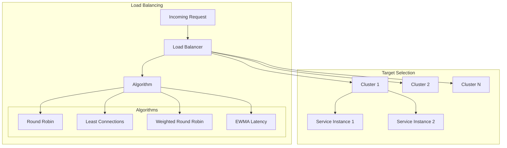

## Error Handling & Resilience

### Circuit Breaker Pattern

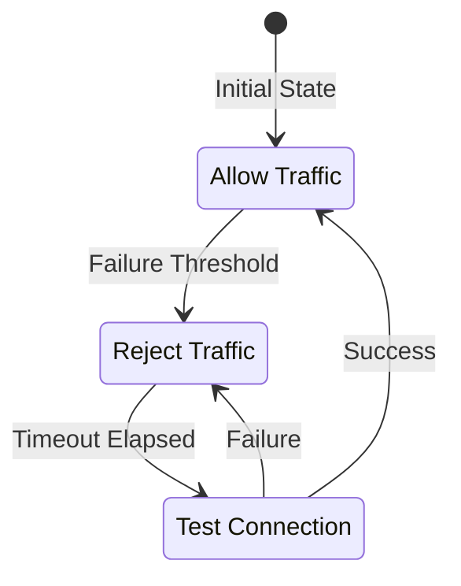

### Retry Strategy

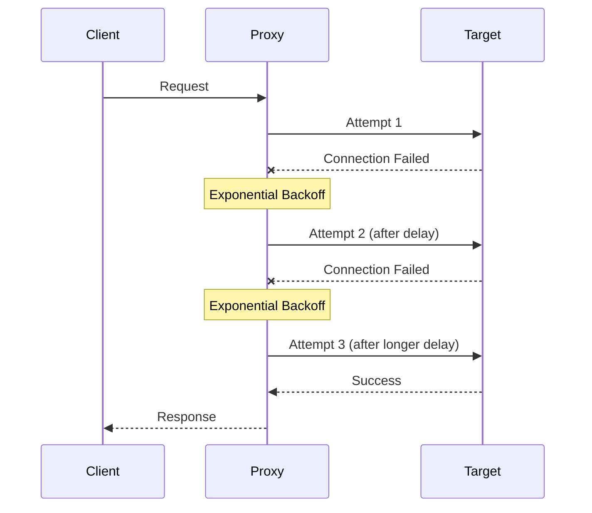

This architecture provides a comprehensive foundation for building a production-ready P2P service mesh using iroh's networking capabilities while maintaining compatibility with existing Kubernetes infrastructure.